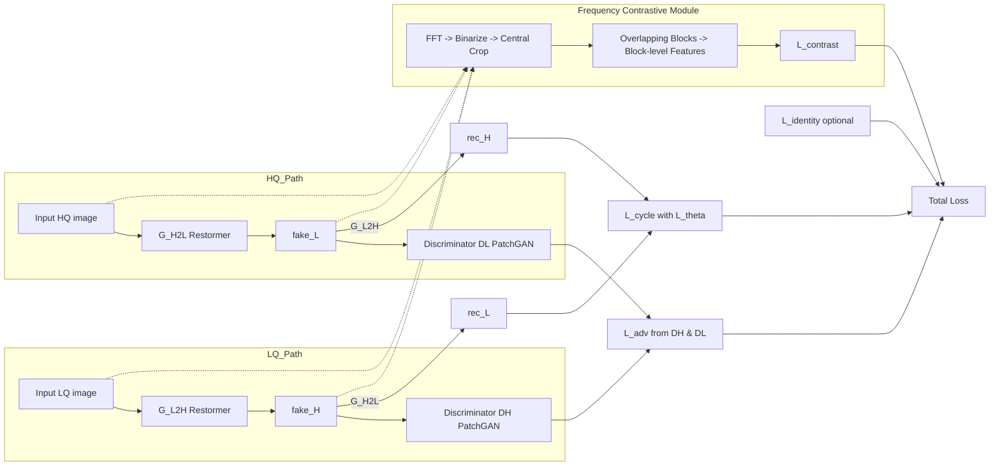

# Tái hiện mô hình UFR-GAN - Trần Nhật Uy IT-E10 01 K69
Dưới đây mình trình bày rõ ràng, tuần tự và chi tiết toàn bộ phần Methodology (mục 3) của mô hình — bao gồm tầm nhìn tổng quan, kiến trúc (chi tiết từng thành phần), mô-đun miền tần số + bước tiền xử lý đặc thù, hàm mất mát (loss) và quy trình huấn luyện (kèm pseudo-code và các lưu ý thực thi). Các phần trích dẫn nội dung cơ bản trong bài báo có đánh dấu nguồn.

Ghi chú nguồn: Triển khai trong repository này bám sát bài báo UFR-GAN (Nguyen et al., 2025) được liệt kê ở mục “Tài liệu tham khảo”.

---

## 3.1 Tổng quan (Overview) — ý tưởng và luồng chính

- Mục tiêu: xây dựng một mô hình GAN hai chiều (Cycle-like), có khả năng khôi phục nhiều dạng suy giảm ảnh (multi-degradation) trong cùng một kiến trúc nhẹ (ví dụ: mưa, sương mù, nhiễu, mờ chuyển động, low-light, JPEG artifact...).
- Ý tưởng cốt lõi: kết hợp generator Restormer (transformer-based) cho việc phục hồi ảnh với đào tạo không ghép cặp dựa trên cycle-consistency, đồng thời bổ sung chỉ dẫn miền tần số (frequency-domain contrastive learning) để tách/khử các dạng suy giảm chồng lấp.

Luồng vận hành (tóm tắt):

1. Hai generator Restormer song song: GL2H (Low → High) và GH2L (High → Low).
2. Hai discriminator CNN (DL, DH) kiểm tra tính “thật” ở từng miền.
3. Bổ sung mô-đun trích xuất đặc trưng miền tần số (FFT → xử lý → block-level features) để huấn luyện contrastive loss, giúp phân biệt các thành phần tần số liên quan đến artefact khác nhau.

---

## 3.2 Kiến trúc (Architecture) — chi tiết từng thành phần

### 3.2.1 Generators — Restormer-based (GL2H, GH2L)

- Vai trò: mỗi generator là một Restormer encoder–decoder chuyên cho image restoration; GL2H biến LQ → HQ, GH2L ngược lại. Mỗi generator dùng attention để bắt mạch ngữ cảnh toàn cục đồng thời giữ chi tiết cục bộ.
- Thành phần chính (tóm lược Restormer):

	- Multi-Dconv Head Transposed Attention (MDTA): attention được thiết kế tối ưu cho ảnh (giữ local inductive bias bằng depthwise conv trong các head).
	- Gated-DConv Feed-Forward Network (GDFN): feed-forward có depthwise conv/gating để tăng sức mạnh biểu diễn cho ảnh.
	- Down-/Up-sampling stages (encoder/decoder) để xử lý đa tỷ lệ và khôi phục độ phân giải.
	- Residual connections giữa các block để ổn định và bảo toàn chi tiết.
		(Các khái niệm trên dựa trên Restormer nguyên bản và được mô tả là backbone trong bài).

Tại sao dùng Restormer cho generator?

- Captures long-range dependencies (cấu trúc toàn ảnh) — quan trọng khi sửa các suy giảm ảnh có thành phần toàn cục (haze, illumination).
- Giữ local details qua depthwise conv trong attention head — quan trọng cho edges/texture.

---

### 3.2.2 Discriminators — DL và DH (Patch-based CNN)

- Vai trò: DL phân biệt ảnh LQ thật/giả; DH phân biệt HQ thật/giả.
- Kiến trúc: CNN nối tiếp (multiple conv blocks) + Instance Normalization + LeakyReLU; đầu ra là score map (tức PatchGAN style — phân biệt theo từng patch, không chỉ scalar).
- Ý nghĩa: Patch discriminator ép generator chú ý đến tính hiện thực ở mức cục bộ (local realism), giúp tránh ảnh bị mịn hóa quá mức.

---

### 3.2.3 Mô-đun miền tần số (Frequency module)

Đây là phần then chốt so với CycleGAN truyền thống:

1. Tiền xử lý ảnh:

	 - Chuyển ảnh sang grayscale để nhấn cấu trúc / texture hơn là màu sắc (tập trung vào “hình thái” suy giảm).
2. Chuyển sang miền tần số: áp dụng Fourier Transform (FFT) để lấy phổ tần số.
3. Tinh chỉnh phổ: làm binarization và central cropping (loại bỏ viền và làm nổi bật dải tần trung-trung cao), mục đích giảm artefact do biên và tập trung vùng hữu dụng.
4. Chia thành block chồng lấp (overlapping blocks): mỗi block tạo vector đặc trưng miền tần số cục bộ — giữ được thông tin chi tiết từng vùng trong ảnh.
5. Sử dụng trong contrastive learning: block-level features là cơ sở để so sánh anchor / positive / negative (xem 3.3).

---

## 3.3 Contrastive learning & Loss functions — chi tiết và cách tích hợp

### 3.3.1 Mục tiêu thiết kế loss

Mục tiêu tổng hợp: kết hợp các thành phần loss để vừa:

- Giữ tính thực (adversarial),
- Giữ chi tiết hình thái + cấu trúc (cycle + $L_\theta$),
- Khuyến khích phân tách các thành phần suy giảm trong miền tần số (frequency contrastive).

---

### 3.3.2 Combined per-image loss $L_\theta$ — thành phần của cycle

Bài báo định nghĩa một CombinedLoss $L_\theta$ dùng để so sánh ảnh tái tạo với ảnh gốc; công thức dạng tổng hợp:

$$
L_\theta(x, y) = \lambda_{\ell1}\, L_{\ell1}(x,y) + \lambda_{\text{mse}}\, L_{\text{mse}}(x,y) + \lambda_{\text{perc}}\, L_{\text{perc}}(x,y) + \lambda_{\text{edge}}\, L_{\text{edge}}(x,y) + \lambda_{\text{ssim}}\, L_{\text{ssim}}(x,y)
$$

- $L_{\ell 1}$: L1 pixel-wise — giữ chi tiết cạnh, ít nhạy outlier hơn MSE.
- $L_{\text{mse}}$: MSE — ổn định về năng lượng sai số tổng thể.
- $L_{\text{perc}}$: Perceptual loss — đo khoảng cách trong không gian đặc trưng của mạng pretrained (thông thường VGG) để bắt perceptual similarity (giữ cấu trúc nội dung).
- $L_{\text{edge}}$: Edge loss — so sánh bản đồ gradient (Sobel/Scharr) để thúc ép khôi phục cạnh sắc nét.
- $L_{\text{ssim}}$: SSIM loss — khuyến khích giữ cấu trúc/độ tương đồng cấu trúc từng vùng.
- Hệ số $\lambda_*$ là siêu tham số cần tinh chỉnh cho cân bằng giữa các mục tiêu.

Giải thích vì sao gộp $L_\theta$ vào cycle: khi tính cycle-consistency, thay vì chỉ dùng L1/MSE truyền thống, bài báo đưa $L_\theta$ vào để buộc tái tạo lại phải tốt ở nhiều mặt (perceptual/edge/SSIM), làm cho quá trình “L → G → H → G → L” bảo toàn cả cấu trúc và chi tiết. Công thức cycle trong bài là:

$$
L_{cycle} = \lambda_{cycle}\big[ L_\theta(G_{H2L}(G_{L2H}(L)),\, L) + L_\theta(G_{L2H}(G_{H2L}(H)),\, H) \big]
$$

(công thức và ký hiệu lấy trực tiếp từ bài).

---

### 3.3.3 Frequency contrastive loss ($L_{contrast}$)

- Mục tiêu: trong miền tần số, đưa các biểu diễn tần số “gần nhau” khi chúng thuộc cùng loại (positive pairs), và đẩy xa các biểu diễn khác (negative pairs). Điều này giúp disentangle overlapping degradations: ví dụ mưa (có signature tần số khác) sẽ tách khỏi blur hoặc haze.
- Quy trình tóm tắt:

	1. Tạo đặc trưng tần số cho các block (xem 3.2.3).
	2. Lấy một anchor $q$, một hoặc nhiều positive $q^+$ (ví dụ: block tương ứng đến từ ảnh mục tiêu/đối tượng mong muốn hoặc sample gần giống), và một tập negatives $\{q_n^-\}$.
	3. Dùng hàm đo similarity (cosine) và softmax với temperature $\tau$ để định nghĩa loss theo dạng NT-Xent-like:

$$
L_{contrast}(q, q^+, \{q^-_n\}) = -\log 
\frac{\exp(\mathrm{sim}(q, q^+)/\tau)}{\exp(\mathrm{sim}(q, q^+)/\tau) + \sum_{n=1}^N \exp(\mathrm{sim}(q, q^-_n)/\tau)}
$$

(trình bày công thức tương tự như trong bài).

- Lưu ý chọn positive/negative trong môi trường không ghép cặp:

	- Positive có thể là block tương ứng từ ảnh thực trong miền đích hoặc block từ ảnh tái tạo đã qua một bước biến đổi chu trình (ví dụ dùng ảnh tái tạo vòng một làm pseudo-positive).
	- Negative là block ngẫu nhiên từ tập khác miền hoặc từ cùng ảnh nhưng khu vực khác có đặc trưng tần số khác.
	- Bài báo chủ yếu nêu khái niệm so sánh block-level anchor vs similar/dissimilar để tăng độ nhạy với khác biệt tần số.

---

### 3.3.4 Adversarial loss & tổng hợp hàm mục tiêu

- Adversarial losses: áp dụng cho từng cặp generator–discriminator (GL2H ↔ DH; GH2L ↔ DL). Bản chất giống GAN: generator cố gắng lừa discriminator; discriminator phân biệt thật/giả. Bài báo dùng cấu trúc adversarial standard (PatchGAN) — có thể cài LSGAN hoặc BCE; chi tiết dạng loss adversarial là phần standard của framework GAN.

- Hàm mục tiêu tổng hợp (ví dụ minh họa) — bản tổng quát (ký hiệu các hệ số là siêu tham số):

$$
\mathcal{L}_{total} = \mathcal{L}_{adv} + \lambda_{cycle}\, \mathcal{L}_{cycle} + \lambda_{contrast}\, \mathcal{L}_{contrast} + \lambda_{id}\, \mathcal{L}_{identity}
$$

trong đó:

- $\mathcal{L}_{adv}$: tổng adversarial losses của cả hai chiều.
- $\mathcal{L}_{cycle}$: như ở trên, dùng $L_\theta$.
- $\mathcal{L}_{contrast}$: tổng contrastive loss trên các block tần số.
- $\mathcal{L}_{identity}$ (tuỳ chọn): nếu đưa ảnh thuộc miền đích vào generator thì output ≈ input, giúp giữ màu sắc và tránh thay đổi không cần thiết.

---

## 3.4 Quy trình huấn luyện (Training procedure) — bước từng bước + pseudo-code

### Siêu tham số / cấu hình huấn luyện được đề cập trong bài:

- Optimizer: Adam.
- Learning rate (LR): 0.0002.
- Scheduler: MultiStepLR, giảm LR theo factor 0.5 tại các mốc (the paper ghi dùng MultiStepLR; các mốc cụ thể triển khai tùy theo thiết lập).
- Phần cứng (ví dụ tái hiện): được huấn luyện trên RTX4070 12GB trong thực nghiệm của tác giả.

### Pseudo-code (mô tả tuần tự cho 1 batch)

```python
# Pseudo-code for one training iteration (Python-like)
for step in range(num_steps):
	# Sample batches
	batch_L = sample_batch(domain="L")  # LQ
	batch_H = sample_batch(domain="H")  # HQ

	# Forward pass generators
	fake_H = G_L2H(batch_L)
	rec_L = G_H2L(fake_H)  # L -> H -> L (reconstruction)
	fake_L = G_H2L(batch_H)
	rec_H = G_L2H(fake_L)  # H -> L -> H

	# Cycle-consistency with combined per-image loss L_theta
	L_cycle = lambda_cycle * (
		L_theta(rec_L, batch_L) + L_theta(rec_H, batch_H)
	)

	# Update discriminators (standard GAN)
	D_H_loss = update_discriminator(D_H, real=batch_H, fake=fake_H.detach())
	D_L_loss = update_discriminator(D_L, real=batch_L, fake=fake_L.detach())

	# Frequency contrastive loss
	# - compute FFT features for blocks of fake/real images
	# - compute L_contrast over anchors/positives/negatives
	L_contrast = compute_frequency_contrastive(fake_H, fake_L, batch_H, batch_L)

	# Adversarial generator loss (from both discriminators)
	adv_loss_generators = (
		generator_adv_loss(D_H, fake_H) + generator_adv_loss(D_L, fake_L)
	)

	# Optional identity loss
	L_identity = identity_loss(G_L2H, batch_H) + identity_loss(G_H2L, batch_L)

	# Total generator loss
	loss_G = (
		adv_loss_generators
		+ L_cycle
		+ lambda_contrast * L_contrast
		+ lambda_id * L_identity
	)

	# Backprop update generators (Adam, lr=2e-4)
	optimizer_G.zero_grad()
	loss_G.backward()
	optimizer_G.step()

	# Scheduler step per epoch / milestones (handled outside this loop as needed)
```

### Freeze / unfreeze discriminator (chiến lược ổn định)

- Bài báo đề cập có "utility methods to freeze or unfreeze discriminator parameters" để cân bằng adversarial dynamics (không nêu ngưỡng cụ thể).
- Chiến lược thực tế khuyến nghị (gợi ý thực thi):

	- Cập nhật discriminator vài bước (k) rồi cập nhật generator vài bước (m) — thông thường k=m=1.
	- Nếu discriminator quá mạnh (ví dụ acc >> 80% hoặc loss discriminator < ngưỡng nhỏ) → tạm freeze discriminator trong vài step để generator bắt kịp.
	- Nếu generator stale (không cải thiện perceptual metrics), mở lại discriminator.
	- Lưu ý: phải theo dõi cả loss và metric (PSNR/SSIM) để điều chỉnh.
		(Phần này là khuyến nghị vận hành — paper chỉ nói có utility để freeze/unfreeze mà không nêu trigger cụ thể).

---

## 3.5 Một số lưu ý triển khai & kỹ thuật ổn định

- Normalization: instance normalization trong discriminator (theo paper). Generator Restormer có thể dùng LayerNorm/TRT variants theo nguyên bản Restormer.
- Perceptual loss: nếu dùng VGG feature, cố định weights pre-trained ImageNet; chọn các layer conv2_2/conv3_3... tuỳ mục tiêu độ chi tiết.
- Khi làm contrastive trên tần số: chuẩn hoá vector (L2) trước khi tính cosine; dùng temperature $\tau \in [0.07, 0.2]$ (giá trị thường dùng trong contrastive literature) — tune theo batch size.
- Batch size: trade-off GPU memory vs. chất lượng contrastive (batch lớn giúp negative pool hơn). Nếu batch nhỏ, dùng memory bank hoặc xây negative từ nhiều patch trong ảnh.
- Ablation: bài báo cho thấy bổ sung “frequency-guided contrastive learning” cải thiện PSNR/SSIM đáng kể (ví dụ tăng từ ~23→~26.87 PSNR trong điều kiện đa suy giảm).

---

## 3.6 Biểu diễn pipeline (sơ đồ luồng chi tiết)



(Trong đó contrastive module kết nối với cả fake & real images qua FFT/block-level features.)

---

## 3.7 Tóm tắt cuối: điểm mạnh / điểm cần chú ý

- Strengths: Restormer giúp khôi phục chi tiết tốt ở ảnh độ phân giải cao; frequency-contrastive giúp disentangle artefacts chồng lấn; cycle + $L_\theta$ giúp bảo toàn cấu trúc và perceptual quality. Kết quả thực nghiệm của tác giả cho thấy PSNR/SSIM vượt trội trên tập hợp multi-degradation.
- Cần chú ý: huấn luyện GAN + transformer có thể nhạy — cần tuning lr, balance update D/G, chọn temperature/negatives cho contrastive, và kiểm soát bộ nhớ (batch size, block size).

---

## Tài liệu tham khảo (References)

- Nguyen, Binh An, Minh Bao Kha, Duc Manh Dao, Huu Kien Nguyen, My Duyen Nguyen, The Vu Nguyen, Namal Rathnayake, Yukinobu Hoshino, and Tuan Linh Dang. "UFR-GAN: A lightweight multi-degradation image restoration model." Pattern Recognition Letters (2025).

